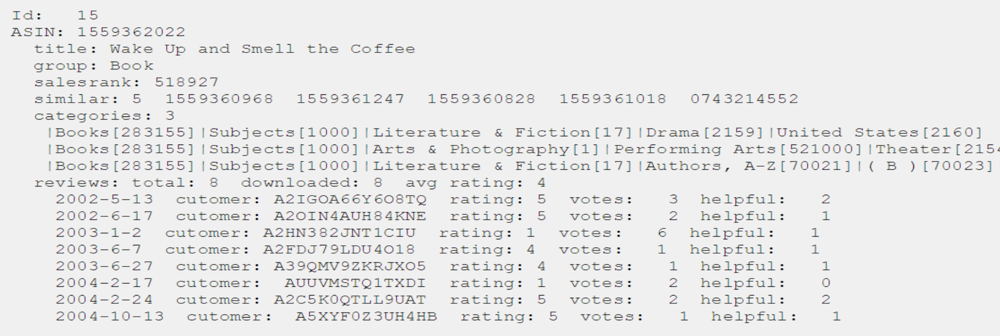

# Amazon Recommendation System

## Introduction
In this lab, we are going to use Amazon Product Co-purchase data to make Book Recommendations using Social Network Analysis Techniques. We shall make use of the concepts covered in this section towards centrality and clustering dynamics of a graph. In particular, we'll make use of the "Island Method" for networks analysis to split the huge graph into smaller islands for identifying similarity between books. 

## Objectives
You will be able to: 

* Read and manipulate graph data and get it ready for analysis
* Apply Network Analysis and graph dynamics concepts to analyze complex networks
* Build a recommendation system using the graph data for complex networks

## Graph Based Recommendation Systems 
From purchase suggestions on e-commerce websites to content customization on multimedia platforms, recommender systems happen to be more and more widespread among the web. Modern companies such as Facebook, Netflix, Amazon all develop their own, aiming to propose items or contents which are more personalized and relevant to their users.

In this lab, we shall build a straightforward recommender system taking advantage of a graph analysis. In graph data, information is stored as nodes, which are linked together by edges. This allows to easily retrieve knowledge about relationships between nodes. Therefore, graphs are useful to describe systems of strongly connected entities, such as social networks or metro networks for example. Following shows an example of movie ratings by a specific user for different movies he has purchased, viewed in the form of graph. [Click here to see more on this experiment](https://www.kernix.com/blog/an-efficient-recommender-system-based-on-graph-database_p9). We shall build a similar system later in the course with a much bigger and complex dataset. 


## Amazon Co-purchase Dataset


This project will use Amazon Meta-Data Set maintained on the Stanford Network Analysis Project (SNAP) website. The data was collected by crawling Amazon website and contains product metadata and review information about 548,552 different products (Books, music CDs, DVDs and VHS video tapes). [Click here to visit the official site](https://snap.stanford.edu/data/amazon-meta.html). This and other similar datasets have been used massively for marketing analytics, customer segmentations and building recommendation systems. 


The following information is available for each product in this dataset:
- __Id: Product id (number 0, ..., 548551)__


- __ASIN: Amazon Standard Identification Number. __

The Amazon Standard Identification Number (ASIN) is a 10-character alphanumeric unique identifier assigned by Amazon.com for product identification. You can lookup products by ASIN using following link: https://www.amazon.com/product-reviews/<ASIN> 

- __Title: Name/title of the product__


- __Group: Product group.__ 

The product group can be Book, DVD, Video or Music.
- __Salesrank: Amazon Salesrank__

The Amazon sales rank represents how a product is selling in comparison to other products in its primary category. The lower the rank, the better a product is selling. 
similar: ASINs of co-purchased products (people who buy X also buy Y)

- __Categories: Location in product category__

hierarchy to which the product belongs (separated by |, category id in [])
- __Reviews: Product review information__ 

Total number of reviews, average rating, as well as individual customer review information including time, user id, rating, total number of votes on the review, total number of helpfulness votes (how many people found the review to be helpful)

The data was collected in summer 2006.


## Data Pre-processing 

The Co-purchase meta dataset is almost 1GB in raw format as shown below:



Pre-processing involves reading and formatting this data for further analysis. This involves some use of parsing techniques with NLP etc. In order to keep our focus on the actual analysis ( and not the data engineering here), this data has been pre-processed for you as follows:

- Parse the amazon-meta.txt file downloaded from the snap side. 

- Read the metadata for all ASINs, and write out the following fields into the `amazonProducts` Nested Dictionary. 

`amazonProducts = (key = ASIN : value = MetaData Dictionary associated with ASIN )`.

- Filter data to include only books as `Group==Book`, and write filtered data to `amazonBooks` Dictionary

- Use the co-purchase data in `amazonBooks` Dictionary to create the `copurchaseGraph` Structure as follows:

    - __Nodes__: the ASINs are Nodes in the Graph
    - __Edges__: an Edge exists between two Nodes (ASINs) if the two ASINs were co-purchased
    - __Edge Weight (based on Category Similarity)__: since we are attempting to make book recommendations based on co-purchase information, it would be nice to have some measure of Similarity for each ASIN (Node) pair that was co-purchased (existence of Edge between the Nodes). We can then use the Similarity measure as the Edge Weight between the Node pair that was co-purchased. We can potentially create such a Similarity measure by using the “Categories” data, where the Similarity measure between any two ASINs that were co-purchased is calculated as follows:
    - __Similarity__ = (Number of words that are common between Categories of connected Nodes)/
            (Total Number of words in both Categories of connected Nodes)
    The Similarity ranges from 0 (most dissimilar) to 1 (most similar).

    Add the following graph-related measures for each ASIN to the amazonBooks Dictionary:
    - __DegreeCentrality__: associated with each Node (ASIN)
    - __ClusteringCoeff__: associated with each Node (ASIN)

- Write out the a`mazonBooks` data to the `amazon-books.txt` file

- Write out the `copurchaseGraph` data to the `amazon-books-copurchase.edgelist` file

>The following preprocessed data files have been provided in the repo for this analysis. 

- `amazon-books.txt`
- `amazon-books-copurchase.edgelist`

## Read Files into python environment 

- Let's first import the necessary libraries we need for this analysis


```python
import networkx as nx
from operator import itemgetter
import matplotlib.pyplot
```

####  Read amazon-books.txt data into `books_dict`  Dictionary

- Set ASIN as they key for each dictionary entry and Metadata as value. The metadata should contain following entries from original data.

- MetaData

    - Id
    - Title
    - Ctagories
    - Group
    - SalesRank
    - TotalReviews
    - AvgRatings
    - DegreeCentrality
    - ClusteringCoeff


```python
# read the data from the amazon-books.txt and populate nested dicitonary:
# key = ASIN; value = MetaData associated with ASIN

# Code here 
```


```python
# Check the total number of records - uncomment to run

# len(books_dict) 

# 393561
```


    393561


#### Read `amazon-books-copurchase.edgelist` into the `books_copurchase_graph` 

- Open the edge list file in read only mode
- Read the edge list into a networkx weighted graph using `nx.read_weighted_edgelist()`
- Print he information about the graph using `nx.info(G)`


```python
# Code Here
```

    Name: 
    Type: Graph
    Number of nodes: 270347
    Number of edges: 741124
    Average degree:   5.4828


So we have quiet a lot of books with even higher number of co purchasing links (edges) between them as we can see here. Trying to visualize this may be an exercise in vain, unless we filter the data by groups/categories of books.

## Let's Make A Purchase

Recommendation systems need initial set of data to actually make future recommendations around products, services or new edges (firends in a social network). For this, we need to select at least one book from the data and work of generating recommendations based on that purchase. You can refer to the `amazon-books.txt` and select a first purchase there. As we are using ASIN as a key to our books dictionary, we would need an ASIN to simulate a purchase.  

- For this experiment, lets purchase the popular sci-fi novel "War of the Worlds" that has `ASIN = 0486405524`. Use this asin to print title, salesRank, total reviews, average ratings , degree centrality and clustering coefficient for this. item 


```python
# Select an ASIN as first purchase - 
# You are welcome to use your own,  just make sure that asin is present in the books file and it has some neighbors

print ("My First Purchase")
print ("-----------------")
asin = '0486405524'

# Print out the features associates with the book

 # Code here 
    
    
```

    My First Purchase
    -----------------
    Title =  The War of the Worlds (Dover Children's Thrift Classics)
    ASIN =  0486405524
    SalesRank =  990009
    TotalReviews =  186
    AvgRating =  4.0
    DegreeCentrality =  5
    ClusteringCoeff =  0.84


>__So how do we make other Book Recommendations with this purchase, based on the book co-purchase data that we have__?


We could potentially take **ALL** books that were ever co-purchased with this book, and recommend all of them. We notice that this Book has a Degree Centrality of 5 i.e. 5 other Books were co-purchased with this Book by other customers. However, the Degree Centrality of Nodes in a product Co-Purchase Network can typically be pretty large, specially for a popular products. e.g. let's try `ASIN=0805047905`. 


```python
# Create variable dcl from the copurchaseGraph data using the networkx.degree package 
# Create new variable dc is equal to dcl of given asin 
# print dc
temp_asin = '0805047905'
print(books_dict[temp_asin]['Title'])
dcl = nx.degree(books_copurchase_graph)
dc = dcl[temp_asin]
print ("Degree Centrality:", dc)
print()
```

    Brown Bear, Brown Bear, What Do You See?
    Degree Centrality: 216
    


We should therefore come up with a better strategy as we can't recommend 216 books with a single purchase, without any clear ordering and filtering.  So we will use __Ego Networks__. 


## Bring in the Ego Network

- Get the list books that have been co-purchased with the purchased book (War of the Worlds) in the past. i.e. get the **depth-1** ego network of purchased book from `books_copurchase_graph` using `nx.egograph()`.
- Assign the resulting graph to `purchased_ego_graph`.
- Inspect number of Nodes and Edges and in `purchased_ego_graph`.


```python
# Get ego network of given asin at depth 1 using networkx.ego_graph package + assign to variable ego_graph
# print number of nodes and edges in ego_graph

ego_graph = None 

# Uncomment to run below

# print ("Ego Network:", 
#       "Nodes =", ego.number_of_nodes(), 
#       "Edges =", ego.number_of_edges())

```

    Ego Network: Nodes = 6 Edges = 12


We shall now use island method on ego network with a threshold of 0.5 to trim down the ego network. You can experiment with the trim value to see the effect of selection of recommendations. For now, lets perform following steps:
-  Set threshold value to 0.5


- Create empty graph instance `trimmed_ego_net` using the `nx.Graph()`to represent the trimmed network


- Iterate through the edge data (to, from, weight)  in `ego_graph`:

    - if edge weight is greater than or equal to defined threshold:
    
        - add node 1, node 2, edge weight to the egotrim tuple
        
        
- Print edges and nodes in the `trimmed_ego_net`

- Print list of `trimmed_ego_net` network to obtain the asin of the books in the trimmed network


```python
# Create empty graph instance `trimmed_ego_net` using the `nx.Graph()`to represent the trimmed network

threshold = None
trimmed_ego_net = None

# Iterate

# Code here 
```

    Trimmed Ego Network: 
    ____________________
     
    Threshold= 0.5 
    Nodes = 6 
    Edges = 10
    
    ASINs in the trimmed network: 
     ['0812550927', '0140022651', '0812505042', '0553214322', '0486405524', '0486270718']


This is great. We can now inspect the neighbor ASINs in our trimmed network as below:

- Print out the neighbors of the asin in the trimmed network
- Create variable called neighbors which contains the neighbors of the given asin in the trimmed network 
- print list of neighbors


```python
# Print out the neighbors of the asin in the trimmed network

# code here 
```


    ['0812505042', '0553214322', '0486270718']


## Make Recommendations 

Great, we are almost there. We just need to use above ASINs to extract actual book data that these ASINs represent, and that would be our recommendations. Perform following steps:
- Iterate through the list of neighbors created above. 
- Use `books_dict` to extract following information for the dictionary 
    -  ASIN
    - Title from the amazonBooks dataset
    - AvgRating from the amazonBooks dataset
    - TotalReviews from the amazonBooks dataset


```python
# code here 
```

    Purchased Book
    Title:  The War of the Worlds (Dover Children's Thrift Classics)
    
    Customers who bought this book, also bought
    
    -------------------------------------------
    
    Asin:  0553214322
    Book Title:  The Island of Dr. Moreau (Bantam Classics)
    Average Rating: 4.0
    Number of Reviews:  54
    
    Asin:  0486270718
    Book Title:  The Invisible Man (Dover Thrift Editions)
    Average Rating: 3.5
    Number of Reviews:  21


There we have it, our graph based recommendation system. We can see that network is attempting to recommend books that are very similar in taste to the original purchase. That is the beauty of Recommendation Systems.


## Level up - Optional 

- Package above code into functions to simple pass in a book ASIN and get recommendations. 
- Use movie lens database with this approach to recommend movies. 

## Additional Resouces. 

This dataset used in this experiment was set up and introduced in the following paper focused at digital marketing. Although it is not mandatory, we would encourage you to read this paper to see how such products can become game changers for a number of data driven businesses.

http://www.cs.cmu.edu/~jure/pubs/viral-tweb.pdf

## Summary 

In this lab, we built a recommendation system using Graph analysis techniques that we covered in this section. This is a simple recommendation system and can be improved a lot by bringing in more data i.e. user reviews, categories of books and in some cases, some manual fine tuning to create custom edges promoting recommendations. We shall look at another technique called collaborative filtering later in the course where we shall try to expand upon this experiment. 
